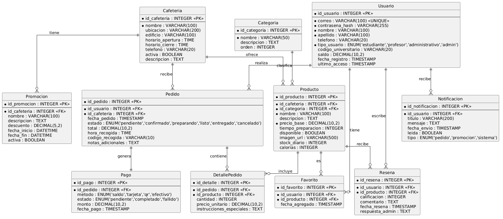

#  Diagrama de Despliegue

## Descripción General

El diagrama de despliegue representa la arquitectura física del sistema y cómo los distintos componentes de la aplicación se distribuyen en los nodos tecnológicos.

En este proyecto, el actor principal es el **Usuario**, quien interactúa con la aplicación móvil desarrollada en **Flutter** desde un dispositivo **Android**. Esta aplicación se comunica con un backend en la nube, el cual gestiona la lógica del sistema, incluyendo autenticación, gestión de pedidos, productos y usuarios.

El backend está conectado a una base de datos (**Firebase Firestore**), donde se almacenan los datos del sistema de manera persistente. Asimismo, se utiliza un servicio de notificaciones para informar al usuario sobre el estado de sus pedidos en tiempo real.

Esta arquitectura permite cumplir con los requisitos no funcionales como disponibilidad, escalabilidad y rendimiento, al apoyarse en servicios en la nube y comunicación en tiempo real.

---

## Componentes del Sistema

-  **Dispositivo Móvil (Usuario)**  
  Ejecuta la aplicación Flutter y permite la interacción con el sistema.

-  **Backend (Servidor / Firebase)**  
  Procesa solicitudes, gestiona la lógica de negocio y maneja la comunicación con la base de datos.

-  **Base de Datos (Firestore)**  
  Almacena información de usuarios, pedidos, productos y demás entidades.

-  **Servicios Externos** 

## Diagrama de base de datos



## Código del Diagrama (PlantUML)

```text
@startuml
hide circle
skinparam linetype ortho

' =========================
'  USUARIO
' =========================
entity "Usuario" as usuario {
  * id_usuario : INTEGER <<PK>>
  --
  * correo : VARCHAR(100) <<UNIQUE>>
  * contrasena_hash : VARCHAR(255)
  * nombre : VARCHAR(100)
  * apellido : VARCHAR(100)
  telefono : VARCHAR(20)
  * tipo_usuario : ENUM('estudiante','profesor','administrativo','admin')
  codigo_universitario : VARCHAR(20)
  saldo : DECIMAL(10,2)
  fecha_registro : TIMESTAMP
  ultimo_acceso : TIMESTAMP
}

' =========================
'  CAFETERIA
' =========================
entity "Cafeteria" as cafeteria {
  * id_cafeteria : INTEGER <<PK>>
  --
  * nombre : VARCHAR(100)
  ubicacion : VARCHAR(200)
  edificio : VARCHAR(100)
  horario_apertura : TIME
  horario_cierre : TIME
  telefono : VARCHAR(20)
  activa : BOOLEAN
  descripcion : TEXT
}

' =========================
'  CATEGORIA
' =========================
entity "Categoria" as categoria {
  * id_categoria : INTEGER <<PK>>
  --
  * nombre : VARCHAR(50)
  descripcion : TEXT
  orden : INTEGER
}

' =========================
'  PRODUCTO
' =========================
entity "Producto" as producto {
  * id_producto : INTEGER <<PK>>
  --
  * id_cafeteria : INTEGER <<FK>>
  * id_categoria : INTEGER <<FK>>
  * nombre : VARCHAR(100)
  descripcion : TEXT
  * precio_base : DECIMAL(10,2)
  tiempo_preparacion : INTEGER
  disponible : BOOLEAN
  imagen_url : VARCHAR(500)
  stock_diario : INTEGER
  calorias : INTEGER
}

' =========================
'  PEDIDO
' =========================
entity "Pedido" as pedido {
  * id_pedido : INTEGER <<PK>>
  --
  * id_usuario : INTEGER <<FK>>
  * id_cafeteria : INTEGER <<FK>>
  fecha_pedido : TIMESTAMP
  estado : ENUM('pendiente','confirmado','preparando','listo','entregado','cancelado')
  total : DECIMAL(10,2)
  hora_recogida : TIME
  codigo_recogida : VARCHAR(10)
  notas_adicionales : TEXT
}

' =========================
'  PAGO (NUEVO )
' =========================
entity "Pago" as pago {
  * id_pago : INTEGER <<PK>>
  --
  * id_pedido : INTEGER <<FK>>
  metodo : ENUM('saldo','tarjeta','qr','efectivo')
  estado : ENUM('pendiente','completado','fallido')
  monto : DECIMAL(10,2)
  fecha_pago : TIMESTAMP
}

' =========================
'  DETALLE PEDIDO
' =========================
entity "DetallePedido" as detalle_pedido {
  * id_detalle : INTEGER <<PK>>
  --
  * id_pedido : INTEGER <<FK>>
  * id_producto : INTEGER <<FK>>
  cantidad : INTEGER
  precio_unitario : DECIMAL(10,2)
  instrucciones_especiales : TEXT
}

' =========================
'  FAVORITOS
' =========================
entity "Favorito" as favorito {
  * id_favorito : INTEGER <<PK>>
  --
  * id_usuario : INTEGER <<FK>>
  * id_producto : INTEGER <<FK>>
  fecha_agregado : TIMESTAMP
}

' =========================
'  NOTIFICACIONES
' =========================
entity "Notificacion" as notificacion {
  * id_notificacion : INTEGER <<PK>>
  --
  * id_usuario : INTEGER <<FK>>
  titulo : VARCHAR(200)
  mensaje : TEXT
  fecha_envio : TIMESTAMP
  leida : BOOLEAN
  tipo : ENUM('pedido','promocion','sistema')
}

' =========================
'  PROMOCION
' =========================
entity "Promocion" as promocion {
  * id_promocion : INTEGER <<PK>>
  --
  * id_cafeteria : INTEGER <<FK>>
  nombre : VARCHAR(100)
  descripcion : TEXT
  descuento : DECIMAL(5,2)
  fecha_inicio : DATETIME
  fecha_fin : DATETIME
  activa : BOOLEAN
}

' =========================
'  RESEÑA
' =========================
entity "Resena" as resena {
  * id_resena : INTEGER <<PK>>
  --
  * id_usuario : INTEGER <<FK>>
  * id_producto : INTEGER <<FK>>
  calificacion : INTEGER
  comentario : TEXT
  fecha_resena : TIMESTAMP
  respuesta_admin : TEXT
}

' =========================
'  RELACIONES
' =========================
usuario ||--o{ pedido : realiza
usuario ||--o{ favorito : tiene
usuario ||--o{ notificacion : recibe
usuario ||--o{ resena : escribe

cafeteria ||--o{ producto : ofrece
cafeteria ||--o{ pedido : recibe
cafeteria ||--o{ promocion : tiene

categoria ||--o{ producto : clasifica

producto ||--o{ detalle_pedido : incluye
producto ||--o{ favorito : es
producto ||--o{ resena : recibe

pedido ||--o{ detalle_pedido : contiene
pedido ||--|| pago : genera
@enduml
