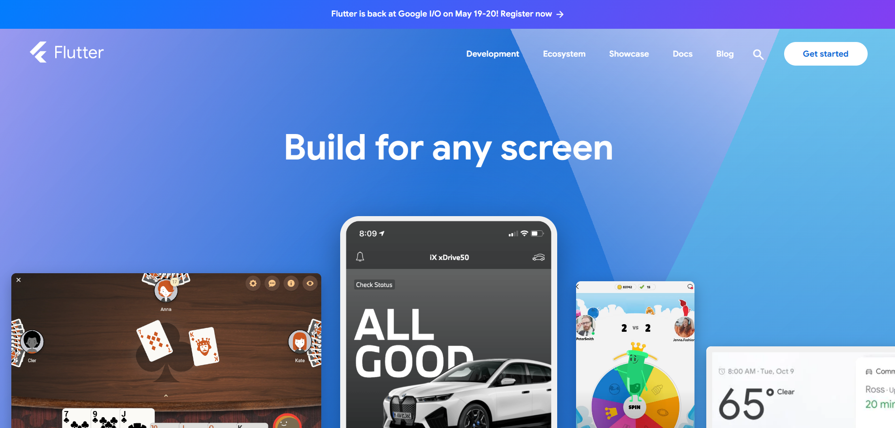
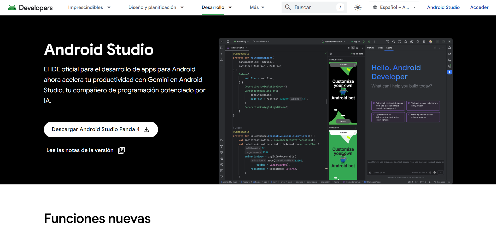
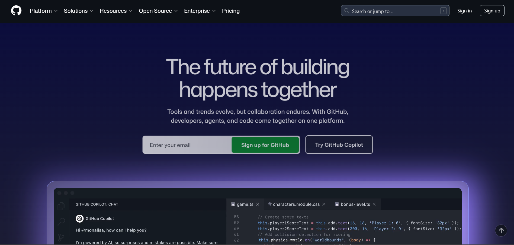

#  Herramientas de Desarrollo

En este proyecto se utilizarán diversas herramientas para el desarrollo, diseño, pruebas y gestión del código de la aplicación móvil.

---

##  Flutter



**Descripción:**
- Flutter es un **framework de desarrollo** creado por **Google** que permite construir aplicaciones móviles nativas para **Android e iOS** con un solo código base. 
- Utiliza el lenguaje **Dart** y destaca por su rapidez, widgets personalizables y alto rendimiento.

**Instalación:**
1. Ir a la página oficial: https://flutter.dev
2. Descargar el SDK de Flutter según tu sistema operativo.
3. Extraer el archivo en una carpeta (ej: `C:\flutter`).
4. Agregar Flutter al PATH del sistema.
5. Ejecutar en terminal:
   ```bash
   flutter doctor
   ```

##  Android Studio



**Descripción:**

- **Android Studio** es el IDE oficial para el desarrollo de aplicaciones Android.
- Permite ejecutar emuladores, depurar código y trabajar fácilmente con Flutter.

**Instalación:**

1. Descargar desde: https://developer.android.com/studio
2. Ejecutar el instalador.
3. Seleccionar componentes (Android SDK, Emulator).
4. Crear un dispositivo virtual (AVD).


##  Figma


**Descripción:**
- Figma es una herramienta de **diseño UI/UX** basada en la web.  
- Permite crear prototipos, interfaces y flujos de usuario de forma colaborativa en tiempo real.  
- Es ideal para diseñar las pantallas de la aplicación antes del desarrollo en Flutter.

**Instalación:**
1. Ir a: https://www.figma.com  
2. Crear una cuenta (puede ser con Google).  
3. Usar directamente desde el navegador o descargar la app de escritorio.  
4. Crear un nuevo archivo de diseño (Design File).  
5. Empezar a diseñar las pantallas de la aplicación.

##  GitHub



**Descripción:**
- GitHub es una plataforma de **control de versiones** que permite almacenar y gestionar el código del proyecto.  
- En este caso se utilizará **GitHub Desktop**, una aplicación con interfaz gráfica que facilita el uso de Git sin necesidad de comandos.  
- Permite realizar commits, manejar versiones, trabajar con ramas y sincronizar cambios con el repositorio en la nube de forma sencilla.

**Instalación:**
1. Ir a: https://desktop.github.com  
2. Descargar e instalar GitHub Desktop.  
3. Iniciar sesión con tu cuenta de GitHub.  
4. Clonar un repositorio o crear uno nuevo desde la aplicación.  
5. Seleccionar la carpeta del proyecto.

**Uso básico:**
1. Realizar cambios en el proyecto.  
2. Abrir GitHub Desktop y ver los cambios detectados.  
3. Escribir un mensaje de commit.  
4. Hacer clic en **"Commit to main"**.  
5. Presionar **"Push origin"** para subir los cambios a GitHub.

##  Base de Datos
